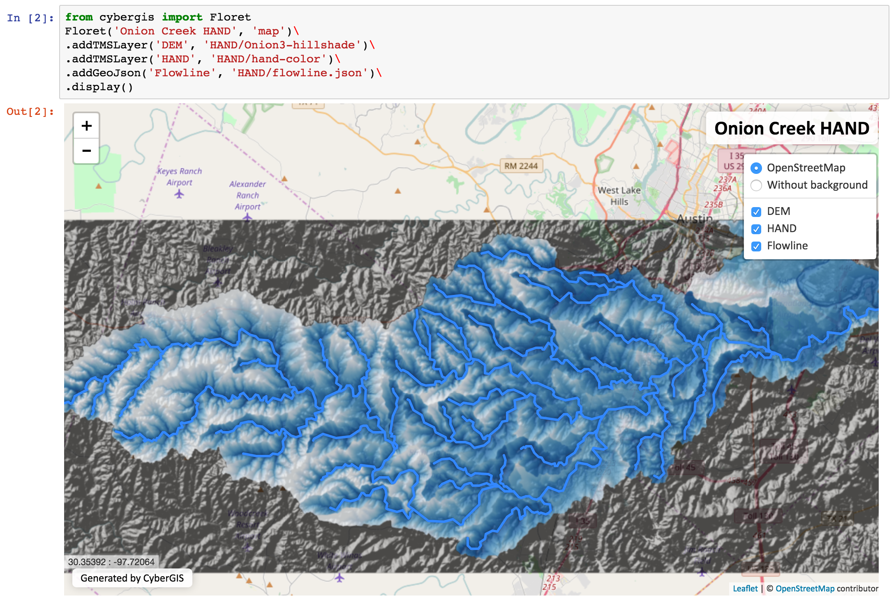
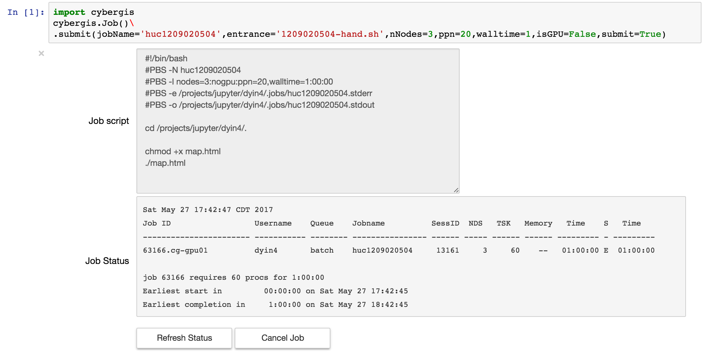

# CyberGIS libraries for Jupyter environment

This repository contains a Python package "cybergis", with a set of tool libraries designed to be used in Jupyter environment.

Reference: Dandong Yin, Yan Liu, Anand Padmanabhan, Je  Terstriep, Johnathan Rush, and Shaowen Wang. 2017. A CyberGIS-Jupyter Framework for Geospatial Analytics at Scale. In Proceedings of PEARC17, New Orleans, LA, USA, July 09-13, 2017, 8 pages. https://doi.org/10.1145/3093338.3093378

The package now containes 2 libraries: *Floret* and *Job*

## **Floret**

Floret is a basic map visualization tool based on [Leaflet](http://leafletjs.com/). It supports basic layer-control and transparency for both raster (in TMS format) and vector (in GeoJson format) data.

### Example

## **Job**

Job is a manager interface to Batch systems on high-performance computing systems. Currently bind to [ROGER](https://wiki.ncsa.illinois.edu/display/ROGER/ROGER%3A+The+CyberGIS+Supercomputer) and requires authorized account to use.

### Example

